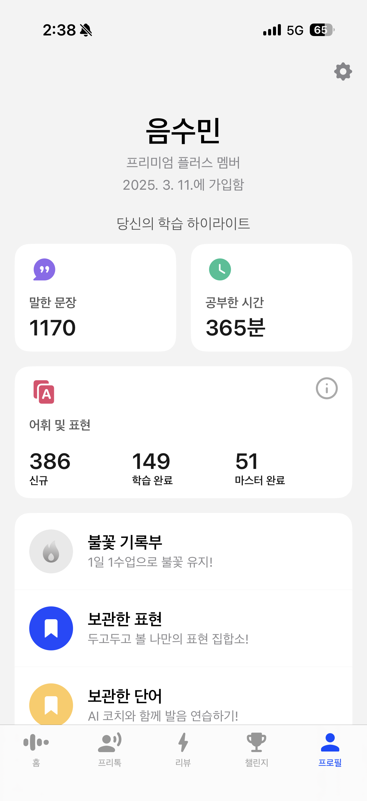

# 프로젝트 백엔드 분리 및 Firebase 이관 아키텍처 설계 (PLAN.md)

이 문서는 기존 프로젝트의 기능을 Firebase 기반 서버리스 아키텍처로 전환하고, 관리자 및 학습자 기능을 구현하기 위한 상세 계획서입니다.

## 1. 기술 스택 (Tech Stack)

* Frontend: React (Tailwind CSS)

* Backend: Firebase (Auth, Firestore, Storage, Cloud Functions)

* TTS API: Google Cloud TTS or OpenAI TTS

* Notification: SendGrid (via Firebase Functions) or Firebase Cloud Messaging

## 2. 데이터 모델링 (Firestore Structure)

`access_codes` (Public Data)

* 관리자가 생성하는 로그인용 코드 정보

```json
{
  "code": "ABCD-1234",
  "role": "admin" | "student",
  "isUsed": boolean,
  "assignedTo": "uid",
  "createdAt": "timestamp"
}
```


`users` (Private Data)

* 사용자 프로필 및 학습 상태

```json
{
  "uid": "string",
  "profile": { "name": "string", "goal": "string" },
  "role": "admin" | "student",
  "stats": {
    "totalStudyTime": number (seconds),
    "currentSentenceId": "string",
    "masteredSentences": ["id1", "id2"],
    "lastActive": "timestamp"
  }
}
```


`learning_sets` (Public Data)

* CSV 업로드를 통해 생성된 퀴즈 및 학습 데이터

```json
{
  "setId": "string",
  "title": "string",
  "sentences": [
    { "id": "1", "text": "string", "translation": "string", "ttsUrl": "url" }
  ],
  "createdAt": "timestamp"
}
```


## 3. 핵심 기능 설계 및 구현 전략

### 3.1 코드 기반 로그인 (Custom Auth Flow)

* 방법: 사용자가 코드를 입력하면 Cloud Function이 access_codes 컬렉션에서 해당 코드를 검증합니다.

* 인증: 유효한 코드일 경우 signInAnonymously 또는 Custom Token을 발급하여 로그인 세션을 유지합니다.

* 권한: 로그인 성공 후 Firestore의 role 필드에 따라 UI를 분기합니다.

### 3.2 TTS 보관 및 지연시간 최적화 (<100ms)

* 저장: Firebase Storage에 .mp3 파일 저장.

* 최적화:

	1. Firebase Hosting/CDN: 자주 사용하는 TTS 파일은 CDN에 캐싱.

	2. Pre-fetching: 현재 문장을 학습하는 동안 다음 문장의 TTS 파일을 브라우저 메모리에 미리 로드(Pre-load).

	3. Service Workers: 로컬 캐시를 활용하여 네트워크 지연 없이 즉시 재생.

### 3.3 관리자 기능: CSV 업로드 및 자동 처리

1. 관리자가 대시보드에서 CSV 업로드.

2. Trigger: Firebase Storage 업로드 이벤트가 Cloud Function 호출.

3. Task:

	* CSV 파싱 및 JSON 변환.

	* 각 문장에 대해 TTS API 호출 및 오디오 파일 저장.

	* Firestore에 학습 세트 데이터 업데이트.

4. Notification: 모든 작업 완료 시 사용자 이메일로 알림 전송 (Nodemailer/SendGrid).

### 3.4 학습자 대시보드 (Visual Dashboard)

* 주요 지표 (Main Metrics):

    * 오늘의 학습 시간: 당일 누적 학습 시간을 분/초 단위로 표시.

    * 학습 진행도 (Ring Chart): 전체 문장 중 '마스터'한 문장의 비율을 원형 프로그레스 바로 시각화.

    * 연속 학습일 (Streak): 최근 며칠간 연속으로 접속하여 학습했는지 표시.

* 학습 현황 상세 (Detailed Status):

    * 학습 중인 문장 (In Progress): 현재 노출되고 있으나 마스터 기준(예: 누적 학습 시간 5분 미만 혹은 10회 미만 반복)을 충족하지 못한 문장 리스트.

    * 마스터한 문장 (Mastered): 설정된 임계치 이상의 학습 시간을 소요한 문장들. '마스터' 뱃지 부여 및 목록 별도 보관.

    * 최근 학습 히트맵 (Learning Heatmap): GitHub 잔디와 유사하게 일자별 학습량(시간 기반)을 색상의 농도로 표현.

* 실시간 트래킹 (Live Tracking):

    * 문장별로 타이머를 작동시켜 실제 '활성화'된 시간을 stats.totalStudyTime에 반영.

    * 창이 비활성화되거나 학습을 멈추면 타이머 자동 일시정지 로직 포함.

* 컴포넌트: `StudyStatusCard`, `SentenceProgressChart`.

* 데이터 흐름: Firestore의 users/{uid} 문서를 실시간 구독(onSnapshot)하여 학습 시간 및 마스터한 문장 수를 실시간 업데이트.

* 예시: 

## 4. 단계별 구현 로직 (Roadmap)

### Phase 1: 기반 설정 및 인증

* [ ] Firebase 프로젝트 초기화 및 보안 규칙 설정.

* [ ] 관리자가 코드를 생성하는 AdminCodeGenerator 컴포넌트 구현.

* [ ] 사용자가 코드로 로그인하는 LoginOverlay 구현.

### Phase 2: 파일 저장소 및 데이터 연동

* [ ] Public 영역에 CSV, JSON 파일 보관 구조 설계.

* [ ] Frontend에서 learning_sets를 fetch하여 렌더링하는 로직 구현.

### Phase 3: 백엔드 자동화 (Cloud Functions)

* [ ] Storage 트리거 함수 작성: CSV 업로드 시 자동 TTS 생성 로직.

* [ ] TTS 생성 완료 후 이메일 알림 연동.

### Phase 4: 학습자 프로필 및 통계

* [ ] 사용자 프로필 작성 기능.

* [ ] 학습 세션 트래킹 (시작/종료 시간 기록 및 통계 계산).

* [ ] 시각화 대시보드 UI 구현 (Mastered vs Learning).

## 5. 보안 규칙 (Firebase Security Rules)

* `/public/data/**`: 누구나 읽기 가능, 관리자만 쓰기 가능.

* `/users/{userId}/**`: 본인만 읽기/쓰기 가능 (`auth.uid == userId`).

* `/access_codes/**`: 관리자 권한(`role == admin`) 사용자만 모든 작업 가능.

